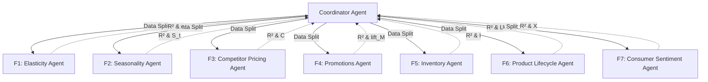

# Multi-Agent Pricing & Demand Framework Logic

This document details the architecture, math formulas, and interaction rules for the multi-agent system implemented for the Pricing and Demand Approximation model.

---

## 1. System Architecture

The framework is structured as a hierarchical multi-agent system:

- **Coordinator Agent**: Acts as the orchestrator. It performs spike detection on raw sales, cleans the dataset, runs the baseline price-elasticity OLS regression, dispatches appropriate subsets of data to the 7 factor agents in parallel, gathers their outputs, normalizes their weights, applies the final demand projection formulas, and evaluates hard stops and human checklists.
- **Factor Agents (F1 - F7)**: Modular sub-agents designed to run concurrently. Each agent processes data relevant to its specific domain, computes a factor multiplier or modifier, determines its individual \( R^2 \) explanatory power relative to the price-demand residuals, assesses its reliability, and handles fallbacks if data is missing or unreliable.

---

## 2. Core Mathematical Formulas

### Master Demand Projection
The projected quantity demanded for a target SKU at a new price \( P_{\text{new}} \) is modeled as:
$$Q_{\text{new}} = Q_{\text{base}} \times \left(\frac{P_{\text{new}}}{P_{\text{base}}}\right)^{e_{\text{eff}}} \times S \times I \times (1 + \text{lift}_M)$$

Where:
- \( Q_{\text{base}} \): Historical base weekly quantity.
- \( P_{\text{base}} \): Historical base weekly unit price.
- \( e_{\text{eff}} \): The effective elasticity, defined as:
  $$e_{\text{eff}} = e \times C \times L \times X$$
- \( S \): Seasonality multiplier.
- \( I \): Inventory/stockout scarcity multiplier.
- \( \text{lift}_M \): Promotions/marketing volume lift percentage.

### Profit Formula
$$\text{Profit} = (P_{\text{new}} - \text{Cost}) \times Q_{\text{new}}$$

### Dynamic Weight Normalization
Each active factor \( i \) is weighted by its \( R^2_i \) explanatory power. The normalized weight is calculated as:
$$w_i = \frac{R^2_i}{\sum_{j \in \text{Active}} R^2_j}$$

- **AI System Rule**: If a factor's data is missing or its \( R^2_i = 0 \), the factor's value is set to its neutral default (1.0 or 0.0), and it is excluded from the weights denominator. The remaining weights are renormalized to sum to 1.0.

---

## 3. Individual Factor Agent Specifications

### F1: Price Elasticity Agent (\( e \))
- **Logic**: Fits log-linear OLS:
  $$\log(Q_t) = \alpha + e \cdot \log(P_t) + \epsilon_t$$
- **Reliability & Fallback**:
  - Requires \(\ge 30\) weekly data points. If observations \(< 10\), uses category proxy (default -1.5) and labels estimate as **PROVISIONAL**.
  - Flags if \( |e| \) shifts by \( > 0.5 \) between rolling 8-week windows.
  - Normal bounds: \([-0.2, -4.0]\). If \( |e| > 5.0 \), triggers a critical corrupt estimation stop.

### F2: Seasonality Agent (\( S \))
- **Logic**: Aggregates price-adjusted sales residuals by week-of-year:
  $$S_t = \frac{\text{Average Demand in Week } t}{\text{Overall Average Weekly Demand}}$$
  Regresses sales residuals on seasonality dummies to determine \( R^2_S \).
- **Reliability & Fallback**:
  - Requires 2 full seasonal cycles (2 years weekly). Set \( S_t = 1.0 \) if cycles \( < 2 \).
  - Clamp \( S_t \) to range \([0.3, 3.0]\). If \( R^2_S < 0.05 \), sets \( S_t = 1.0 \) and excludes factor.

### F3: Competitor Pricing Agent (\( C \))
- **Logic**:
  $$\text{Gap} = \frac{P_{\text{own}} - P_{\text{comp\_avg}}}{P_{\text{comp\_avg}}}$$
  $$C = 1 + 0.2 \times \text{sign}(\text{Gap}) \times \min(|\text{Gap}|, 0.5)$$
- **Reliability & Fallback**:
  - Clamps Gap at \([-0.5, 0.5]\). If competitor data is missing, sets \( C = 1.0 \).
  - Regresses price residuals against competitor Gap to compute \( R^2_C \).

### F4: Promotions Agent (\( M \))
- **Logic**: Regresses \(\log(Q)\) residuals on the promotion flag indicator (0 or 1) to estimate \( b_{\text{promo}} \):
  $$\text{lift}_M = \exp(b_{\text{promo}}) - 1$$
- **Reliability & Fallback**:
  - Set \( M = 0 \) (\(\text{lift}_M = 0\)) if no promotional campaign is active.
  - Exclude promo periods from baseline \( e \) estimation, or include `promo_flag` as a covariate.

### F5: Inventory Agent (\( I \))
- **Logic**: Calculates inventory coverage:
  $$\text{Coverage (days)} = \frac{\text{Units in Stock}}{\text{Average Daily Sales (last 14 days)}}$$
  - Scarcity uplift: \( I = 1.15 \) if \( \text{Coverage} < 7 \) days.
  - Normal stock: \( I = 1.0 \) if \( 7 \le \text{Coverage} \le 30 \) days.
  - Supply Cap: Captured demand cannot exceed stock: \( Q_{\text{final}} = \min(Q_{\text{new}}, \text{Units in Stock}) \).
- **Reliability & Fallback**:
  - Exclude weeks with \( \text{Coverage} < 3 \) days from elasticity training (censored demand).
  - If \( R^2_I < 0.03 \), set \( I = 1.0 \) and exclude from weights.

### F6: Product Lifecycle Agent (\( L \))
- **Logic**: Modifies elasticity based on time since launch:
  - **Launch** (\(< 6\) months): \( L = 0.70 \) (less price sensitive)
  - **Growth** (\(6 - 18\) months): \( L = 0.85 \)
  - **Mature** (\(> 18\) months): \( L = 1.00 \)
  - **Decline** (\(> 20\%\) YoY sales drop for 2+ quarters): \( L = 1.20 \) (highly price sensitive)
- **Reliability & Fallback**:
  - If product \(< 3\) months old, label \( e \) as PROVISIONAL and use category proxy.

### F7: Consumer Sentiment Agent (\( X \))
- **Logic**:
  $$X = 1 + 0.1 \times \frac{\text{CCI}_{\text{current}} - \text{CCI}_{\text{baseline}}}{\text{CCI}_{\text{baseline}}}$$
- **Reliability & Fallback**:
  - Baseline CCI = 100.
  - If \( R^2_X < 0.05 \), set \( X = 1.0 \) and exclude.
  - **Hard Stop**: If CCI drops by \( > 10 \) points in a month, floor \( X \) at 0.97 and flag projections as highly uncertain.

---

## 4. Spike Detection & Pre-processing Rules

Before fitting the baseline price-elasticity model, the Coordinator Agent runs a spike detection filter to prevent anomalous demand spikes from corrupting the elasticity slope \( e \):

1. **S1 (Statistical Spike)**: Weekly demand vs. rolling 4-week mean has Z-score \( > 2.0 \).
2. **S2 (Velocity Spike)**: Week-on-week demand change \( > 80\% \) in 7 days.
3. **S3 (Unexplained Spike)**: Demand spike with no corresponding price drop, promotion, or seasonal peak.
4. **S4 (Hype Spike)**: Google Trends or social index surge \( > 3\times \) baseline for the same week.
5. **S5 (Confirmed Transient)**: Demand reverts to pre-spike baseline within 3 weeks.

### Classification & Action:
- **Type A (Transient Hype)**: Reverts within 3 weeks, social signal present, no product changes. Exclude from elasticity OLS regression.
- **Type B (Structural Shift)**: New demand baseline is \( 2\times \) above pre-spike, holds for \( 4+ \) weeks. Re-baseline the model, discarding pre-break history.
- **Default / Ambiguous**: Classify as Type A (exclude from training) to avoid corrupting \( e \).
