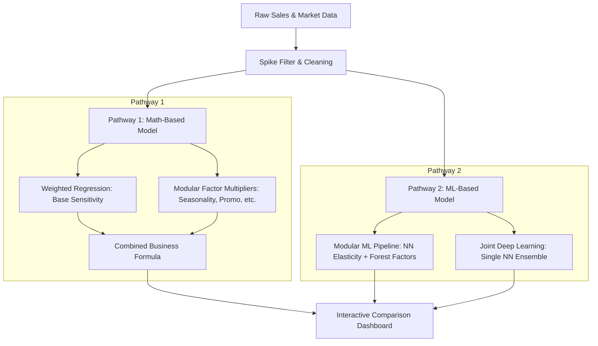

# Pricing & Demand Approximation Models: Technical & Executive Manual

This document provides an in-depth explanation of the two core modeling methodologies implemented in the Pricing Analysis system: the **Math-Based/Statistical Model** and the **Machine Learning (ML) / Deep Learning Model**. 

It is structured to serve two audiences:
1. **The Executive Perspective (CEO/Non-Tech)**: High-level business intuition, analogies, and decision-making utility.
2. **The Technical Perspective (Data Scientist/Developer)**: Exact mathematical formulations, statistical proofs, network architectures, and training mechanics.

---

## Table of Contents
1. [Executive Summary: Math vs. ML](#1-executive-summary-math-vs-ml)
2. [Commonalities and Differences: Math vs. ML](#2-commonalities-and-differences-math-vs-ml)
3. [Shared Foundations: Spike Detection & Pre-processing](#3-shared-foundations-spike-detection--pre-processing)
4. [Model 1: The Math-Based & Statistical Model (WLS & Multipliers)](#4-model-1-the-math-based--statistical-model-wls--multipliers)
5. [Model 2: The Machine Learning & Deep Learning Model](#5-model-2-the-machine-learning--deep-learning-model)
    *   [ML Modular vs. ML Joint Deep Learning](#ml-modular-vs-ml-joint-deep-learning)
6. [Accuracy, Confidence, and Uncertainty (MAPE, R², P10/P90)](#6-accuracy-confidence-and-uncertainty-mape-r-p10p90)
    *   [Model Reliability Classification](#model-reliability-classification)
7. [Comparative Framework: When to Use Which?](#7-comparative-framework-when-to-use-which)

---

## 1. Executive Summary: Math vs. ML

At its core, this system answers a single critical question: **"If we change our product's price by $x\%$, what will happen to our sales volume, revenue, and bottom-line profit?"**

To answer this, the system runs two parallel brains:



### The Math-Based Brain (Weighted Least Squares & Multipliers)
*   **The Intuition**: Think of this as a structured business spreadsheet built by an expert economist. It assumes there is a "baseline" price sensitivity (price elasticity) and applies a chain of logical multipliers to adjust demand based on external factors like competitor pricing, stockouts, promotions, product lifecycle, and consumer sentiment.
*   **The Strength**: Highly transparent. If the system says sales will drop by $15\%$, you can point directly to the specific formula (e.g., "Competitor pricing made us more sensitive") and understand exactly why.
*   **The Weakness**: It assumes relationships are linear or log-linear, meaning it can struggle to capture complex, overlapping interactions (e.g., how a promotion behaves differently *during* a stockout when competitor prices are high).

### The ML-Based Brain (Neural Networks & Ensemble Trees)
*   **The Intuition**: Think of this as a team of data-driven analysts running millions of scenarios. Instead of forcing data into rigid financial formulas, the neural networks adaptively map the shape of historical demand. They detect complex patterns, curves, and interactions that human analysts might miss.
*   **The Strength**: Extremely flexible and highly accurate at capturing complex scenarios. It doesn't assume rules; it learns them.
*   **The Weakness**: Higher complexity ("black-box" nature). Explaining exactly *why* a neural network projected a specific number requires advanced tools (like numerical gradients or feature attribution).

---

## 2. Commonalities and Differences: Math vs. ML

Understanding where these modeling approaches overlap and where they diverge is critical for business trust and operational execution.

### Very Common Areas (Shared Logic)
Both systems rely on the same fundamental framework for data preparation and output interpretation:
1.  **Data Pre-processing and Spike Detection**: Both models ingest the exact same cleaned data. They use the same `SpikeDetector` module to identify statistical demand spikes, classify them as Type A (Transient Hype) or Type B (Structural Break), and handle exclusions and re-baselining identically.
2.  **Time-Decay Prioritization**: Both models apply exponential decay weighting to historical observations. They agree that a sales pattern from last week is significantly more important than a sales pattern from 6 months ago.
3.  **Financial Output Math**: Once a demand projection ($Q_{\text{new}}$) is computed, both models calculate gross revenue and profit margins using the same standard business accounting formulas:
    $$\text{Revenue}_{\text{new}} = P_{\text{new}} \times Q_{\text{new}}$$
    $$\text{Profit}_{\text{new}} = (P_{\text{new}} - \text{Cost}) \times Q_{\text{new}}$$
4.  **Operational Guardrails (Hard Stops)**: Both models obey the same safety boundaries. If consumer sentiment drops sharply ($>10$ points in a month) or price proposals exceed $\pm 25\%$, both models trigger flags and require manual reviews.

### Very Different Areas (Diverging Methodologies)
The two pathways handle calculations, parameters, and risk curves in fundamentally different ways:
1.  **Assumption of Modularity (Interaction Effects)**:
    *   *Math-Based*: Assumes complete independence. It calculates seasonality, promotions, and competitor price changes in isolation, multiplying them together. It cannot capture interactions (e.g., how promotions work differently under stockouts).
    *   *ML-Based*: Learns interactions automatically. In the Joint model, features like price, promotions, and inventory coverage are combined inside the network, allowing the model to capture complex, overlapping effects.
2.  **Price Elasticity Representation**:
    *   *Math-Based*: Assumes constant elasticity. The slope $e$ is a single fixed regression coefficient.
    *   *ML-Based*: Computes local elasticity dynamically. Because neural networks generate curves rather than straight lines, elasticity changes at each simulated price point, calculated via numerical finite difference derivatives.
3.  **Data Requirements and Overfitting Risk**:
    *   *Math-Based*: Highly robust. It can fit a stable price-elasticity slope with as few as 10 data points using industry-standard category proxies.
    *   *ML-Based*: Highly data-hungry. It requires at least 30-52 weeks of clean sales records. With thin data, neural networks are prone to "overfitting"—memorizing noise instead of finding the true price signal.
4.  **Extrapolation Behavior (Risk Curve)**:
    *   *Math-Based*: Predictable and safe. If you simulate a $30\%$ price change, the log-linear curve decays smoothly.
    *   *ML-Based*: Highly unpredictable. Outside the training boundaries (prices the model has never seen before), neural networks can output wild, mathematically unstable demand values.

---

## 3. Shared Foundations: Spike Detection & Pre-processing

Before any calculations take place, the **Coordinator Agent** cleans the sales history. Uncleaned sales data is noisy—for example, a sudden viral video might cause a massive sales spike that has nothing to do with price. If the model includes this spike, it will miscalculate your price sensitivity.

### CEO Explanation: The "Hype vs. Growth" Filter
Imagine your sales suddenly double in week 10. 
*   **Type A Spike (Transient Hype)**: If sales go back to normal in 2-3 weeks, this was temporary noise (e.g., a short holiday rush or viral trend). The system **removes** this week from baseline training so it doesn't skew our understanding of price sensitivity.
*   **Type B Spike (Structural Shift)**: If sales stay high for 4+ weeks, your business has permanently grown (e.g., a new distribution contract or competitor exit). The system **re-baselines** the model, discounting older data and focusing heavily on the new baseline.

### Technical Deep Dive: Statistical Detection Rules
The `SpikeDetector` evaluates every week $t$ using five distinct filters:
1.  **S1 (Statistical Spike)**: Triggers if the current volume $Q_t$ deviates from the rolling 4-week mean $\mu_{4w}$ by more than $2.0$ standard deviations:
    $$Z_t = \frac{Q_t - \mu_{4w}}{\max(0.1, \sigma_{4w})} > 2.0$$
2.  **S2 (Velocity Spike)**: Triggers if the week-on-week change exceeds $80\%$:
    $$\Delta \text{WoW}_t = \frac{Q_t - Q_{t-1}}{\max(0.1, Q_{t-1})} > 0.80$$
3.  **S3 (Unexplained Spike)**: Triggers if there is a spike in volume with no corresponding price reduction, active promotion, or historical seasonal peak.
4.  **S4 (Hype Spike)**: Triggers if the Google Trends or social sentiment index surges by more than $3\times$ its baseline.
5.  **S5 (Confirmed Transient)**: Triggers if demand returns within $3$ weeks to the pre-spike baseline:
    $$Q_{t+k} \le 1.20 \times \text{median}(Q_{t-4}, \dots, Q_{t-1}) \quad \text{for any } k \in \{1, 2, 3\}$$

#### Classification Logic:
*   **Type A (Transient Hype)**: Triggered if S1 or S2 is active **AND** S5 (Reversion) is true. 
    *   *Action*: The week is flagged `exclude_from_regression = True` and omitted from elasticity fitting.
*   **Type B (Structural Shift)**: Triggered if S1 or S2 is active **AND** demand remains elevated for 4 consecutive weeks:
    $$Q_{t+k} \ge 1.80 \times \text{median}(Q_{t-4}, \dots, Q_{t-1}) \quad \forall k \in \{1, 2, 3, 4\}$$
    *   *Action*: The system sets a re-baseline index at week $t$. All prior weeks receive a training weight penalty ($w_{\text{prior}} = 0.20$) to prioritize the new regime.

---

## 4. Model 1: The Math-Based & Statistical Model (WLS & Multipliers)

This model uses traditional microeconomic theory. It decomposes demand into a **baseline log-linear price relationship** adjusted by **modular business factors**.

### 4.1 CEO Intuition: How it Works
Think of your projected weekly demand as an equation of gears:
$$\text{Projected Sales} = \left(\text{Base Sales} \times \text{Price Change}^{\text{Sensitivity}}\right) \times \text{Seasonality} \times \text{Stock Level Adjuster} \times \text{Promo Lift}$$

1.  **Base Sensitivity (Elasticity, $e$)**: If $e = -1.5$, a $10\%$ price increase results in a $15\%$ drop in sales ($10\% \times -1.5 = -15\%$).
2.  **Modifiers**:
    *   *Competitor pricing*: If competitor prices are cheaper, your sensitivity increases (customers are more likely to leave).
    *   *Sentiment*: A drop in consumer confidence increases sensitivity (customers become bargain hunters).
    *   *Product Lifecycle*: Declining products are more price-sensitive than newly launched hyped products.
3.  **Direct Shifters**:
    *   *Seasonality*: Increases demand in peak weeks (e.g., holidays) regardless of price.
    *   *Inventory*: Adjusts for shortages or stockout-driven urgency.
    *   *Promotions*: Boosts quantity sold via marketing reach.

---

### 4.2 Technical Deep Dive: The Formulas

#### The Master Demand Equation
The projected quantity demanded $Q_{\text{new}}$ at a proposed price $P_{\text{new}}$ is modeled as:
$$Q_{\text{new}} = Q_{\text{base}} \times \left(\frac{P_{\text{new}}}{P_{\text{base}}}\right)^{e_{\text{eff}}} \times S \times I \times (1 + \text{lift}_M)$$

Where:
*   $Q_{\text{base}}$ is the average sales volume over the last 4 weeks.
*   $P_{\text{base}}$ is the average price over the last 4 weeks.
*   $e_{\text{eff}}$ is the **effective elasticity**, incorporating structural modifiers:
    $$e_{\text{eff}} = e_{\text{base}} \times C \times L \times X$$
*   $C$, $L$, and $X$ are the competitor, lifecycle, and sentiment elasticity modifiers, respectively.
*   $S$ is the seasonality multiplier.
*   $I$ is the inventory multiplier.
*   $\text{lift}_M$ is the promotional marketing volume lift.

---

### 4.3 Sub-Agent Mathematical Specifications

#### 1. Base Price Elasticity Agent ($e_{\text{base}}$)
The agent estimates the historical baseline price sensitivity by fitting a **Weighted Least Squares (WLS)** log-linear regression:
$$\log(Q_t) = \alpha + e_{\text{base}} \cdot \log(P_t) + \epsilon_t$$

*   **Time-Decay Weighting**: To ensure recent market changes are prioritized, observations are weighted by age:
    $$w_t = 0.92^{\Delta t_t} \times \text{multiplier}_t$$
    where $\Delta t_t$ is the age of the data point in weeks, and $\text{multiplier}_t$ is the rebaselining penalty ($0.2$ for pre-structural-break data, $1.0$ otherwise).
*   **Confidence Propagation**: The OLS/WLS covariance matrix yields the standard error $\text{SE}(e_{\text{base}})$. A $95\%$ confidence interval is computed to establish uncertainty boundaries:
    $$\text{CI} = \left[ e_{\text{base}} - t_{\text{crit}} \cdot \text{SE}(e_{\text{base}}), \ e_{\text{base}} + t_{\text{crit}} \cdot \text{SE}(e_{\text{base}}) \right]$$

#### 2. Seasonality Agent ($S$)
Fits residuals of the price regression onto annual sine and cosine harmonics to capture cyclical demand spikes:
$$\text{residual}_t = \log(Q_t) - (\hat{\alpha} + \hat{e} \log(P_t))$$
$$\text{residual}_t = \beta_0 + \beta_{\sin} \sin\left(\frac{2\pi \cdot \text{week}_t}{52}\right) + \beta_{\cos} \cos\left(\frac{2\pi \cdot \text{week}_t}{52}\right) + u_t$$
*   **Seasonality Multiplier**: 
    $$S_t = \exp\left( \hat{\beta}_0 + \hat{\beta}_{\sin} \sin\left(\frac{2\pi \cdot t}{52}\right) + \hat{\beta}_{\cos} \cos\left(\frac{2\pi \cdot t}{52}\right) \right)$$
    The value is clamped to $[0.3, 3.0]$. If the seasonal regression's explanatory power $R^2 < 0.05$, the agent disables itself ($S_t = 1.0$) to avoid overfitting.

#### 3. Competitor Pricing Agent ($C$)
Computes the percentage gap between the product's price and the average competitor price:
$$\text{Gap}_t = \frac{P_{t, \text{own}} - P_{t, \text{comp\_avg}}}{P_{t, \text{comp\_avg}}}$$
$$\text{Gap\_clamped}_t = \max(-0.5, \min(0.5, \text{Gap}_t))$$
*   **Elasticity Modifier**:
    $$C = 1.0 + 0.2 \cdot \text{sign}(\text{Gap\_clamped}) \cdot \min(|\text{Gap\_clamped}|, 0.5)$$
    *If competitor prices are higher than ours ($\text{Gap} < 0$), $C < 1.0$, flattening effective elasticity (consumers are less sensitive because we are cheap). If competitor prices are lower, $C > 1.0$, steepening elasticity (consumers are highly sensitive).*

#### 4. Promotions Agent ($M$)
Regresses demand residuals against a binary indicator variable representing active promotions:
$$\text{residual}_t = \mu_0 + \beta_{\text{promo}} \cdot \text{is\_promo}_t + \eta_t$$
*   **Promo Lift**:
    $$\text{lift}_M = \exp(\hat{\beta}_{\text{promo}}) - 1.0 \quad (\text{clamped } \ge 0.0)$$

#### 5. Inventory Agent ($I$)
Calculates daily sales inventory coverage:
$$\text{Coverage}_t = \frac{\text{Units in Stock}_t}{\text{Average Daily Sales (last 14 days)}_t}$$
*   **Scarcity Multiplier**: If $\text{Coverage}_t < 7$ days, the agent applies a scarcity-driven volume multiplier ($I = 1.15$).
*   **Capping Constraint**: Projected demand cannot exceed physically available stock:
    $$Q_{\text{final}} = \min(Q_{\text{new}}, \text{Units in Stock})$$

#### 6. Product Lifecycle Agent ($L$)
Modifies base elasticity based on the product's market phase:
$$L = \begin{cases} 
      0.70 & \text{Launch phase (Age } < 6 \text{ months)} \\
      0.85 & \text{Growth phase (Age } 6 \text{ to } 18 \text{ months)} \\
      1.00 & \text{Mature phase (Age } 18 \text{ to } 36 \text{ months)} \\
      1.20 & \text{Decline phase (Age } > 36 \text{ months or sales drop } > 20\% \text{ YoY)}
   \end{cases}$$

#### 7. Consumer Sentiment Agent ($X$)
Measures macro-economic consumer confidence:
$$\text{Signal}_t = \frac{\text{CCI}_t - 100}{100}$$
$$X = 1.0 + 0.1 \cdot \text{Signal}_{\text{current}}$$
*   **Hard Stop**: If the Consumer Confidence Index drops by more than $10$ points in a single month, $X$ is floored at $0.97$, and a warning is triggered.

---

### 4.4 Dynamic Weight Normalization
To prevent inactive or poorly performing factor agents from skewing predictions, the Coordinator Agent dynamically attributes importance based on the **coefficient of determination ($R^2$)** of each sub-agent's regression:
$$w_i = \frac{R^2_i}{\sum_{j \in \text{Active}} R^2_j}$$

If an agent's data is missing or its explanatory power is negligible, it is excluded from the denominator, and the remaining weights are renormalized to sum to $1.0$.

---

## 5. The Machine Learning & Deep Learning Model

The machine learning pathway moves away from rigid assumptions. Instead of assuming linear modifiers, it uses non-linear approximation models to learn interactions directly from the data.

### 5.1 CEO Intuition: How it Works
Think of the ML model as a highly flexible simulator. It comes in two configurations:
*   **Modular ML (The hybrid approach)**: We keep the structured business formula from Model 1, but we swap out the simple linear regression for a **neural network** to estimate price sensitivity. We also replace simple averages with **Random Forests** and **Gradient Boosting** algorithms to estimate seasonality, promotions, and competitor effects.
*   **Joint Deep Learning (The unified brain)**: Instead of calculating elasticity, promotions, and seasonality separately, we feed all features (price, competitor gap, inventory, weather, sentiment) into a single, comprehensive **Deep Neural Network**. The neural network simulates how all these variables interact simultaneously to output a single demand projection.

---

### 5.2 Technical Deep Dive: The ML Architecture

```
                  MODULAR ML PATHWAY                                  JOINT DL PATHWAY
                  
   [ log_price ] ──> Bootstrapped MLP Ensemble (x10)                   [ log_price      ] ──┐
                           │                                           [ sin/cos_week   ] ──┤
                           ▼                                           [ comp_gap       ] ──┤   Bootstrapped
                     Local Elasticity                                  [ is_promo       ] ──┼─> MLP Ensemble (x5)
                e_base = Mean(Finite Diff)                             [ marketing_spend] ──┤   Hidden: (32, 16)
                           │                                           [ inventory_cov  ] ──┤   Activation: tanh
                           ▼                                           [ age_months     ] ──┤
                Effective Elasticity:                                  [ sent_signal    ] ──┤
                 e_eff = e_base * C * L * X                            [ trends_score   ] ──┘
                           │                                                                    │
                           ▼                                                                    ▼
             Final Q = Q_base * (P_new/P_base)^e_eff                                         Projected Q 
                     * S * I * (1 + lift_m)                                             (Ensemble Average)
```

---

### ML Modular vs. ML Joint Deep Learning

The system implements two distinct configurations for machine learning: **ML Modular** and **ML Joint**.

#### 1. ML Modular (The Hybrid pipeline)
*   **How it Works**: It preserves the economic structure of the Master Demand Equation:
    $$Q_{\text{new}} = Q_{\text{base}} \times \left(\frac{P_{\text{new}}}{P_{\text{base}}}\right)^{e_{\text{eff}}} \times S \times I \times (1 + \text{lift}_M)$$
    However, the statistical estimators for each variables are swapped out with specialized ML models:
    *   *Price Elasticity ($e_{\text{base}}$)*: Estimated using an ensemble of 10 MLP Neural Networks.
    *   *Seasonality ($S$)*: Estimated using a **Random Forest Regressor** on sinusoidal time features.
    *   *Competitor pricing ($C$)*: Adjusted using a **Gradient Boosting Regressor** fit to demand residuals.
    *   *Promotions lift ($\text{lift}_M$)*: Estimated via a **Random Forest** to calculate promotional uplift margins.
    *   *Inventory, Lifecycle, Sentiment ($I, L, X$)*:swapped with Random Forests and Gradient Boosting models running on residuals.
*   **Rationale**: Excellent for teams that want the predictive power of ML but require the transparency of a traditional multiplicative formula. It allows isolating individual factor impacts ($S_t, C_t, I_t$) exactly.

#### 2. ML Joint (The Unified Neural Network)
*   **How it Works**: It completely discards the structural multiplication formula. It treats the problem as a single, multi-variable function:
    $$\log(Q) = f\left(\log(P), \text{week}, \sin_t, \cos_t, \text{Gap}, \text{is\_promo}, \text{Spend}, \text{Coverage}, \text{Age}, \text{Signal}, \text{Trends}\right)$$
    This function is fitted end-to-end using an **ensemble of 5 Joint MLP Neural Networks** (hidden layers: `(32, 16)`, activation: `tanh`). All variables are fed into the network simultaneously.
*   **Rationale**: Captures multi-variable interactions. For example, it automatically learns that a promotion has a high volume lift when competitor pricing is high, but a low lift when we are out of stock. It is the most flexible model but operates as a "black box," where elasticity must be extracted via numerical approximation rather than looking at a single parameter.

---

### 5.3 Pathway A: Modular ML Pipeline

#### 1. Neural Network Price Elasticity Agent
Instead of fitting a straight line, this agent uses a **Multi-Layer Perceptron (MLP) Neural Network** ensemble to approximate the local price-demand curve:
*   **Architecture**: 10 bootstrap MLP regressors. Each network consists of:
    *   *Input layer*: 1 unit ($\log(P_t)$).
    *   *Hidden layers*: 2 layers with sizes `(16, 8)`.
    *   *Activation function*: Hyperbolic tangent (`tanh`) to handle smooth non-linearities.
    *   *Optimization Solver*: `lbfgs` (Quasi-Newton optimizer, optimal for datasets with $N < 10,000$).
*   **Training & Bootstrapping**: The 10 networks are trained on bootstrapped replicates of the sales data. The sampling probability for each week is proportional to its time-decay weight:
    $$p_t = \frac{w_t}{\sum_j w_j}$$

#### 2. Calculating Numerical Elasticity via Finite Differences
Because a neural network is non-linear, it does not have a single constant slope like OLS regression. The slope (elasticity) varies depending on the price point. The agent computes the **local elasticity** at the current base price $P_{\text{base}}$ using a numerical **central finite difference** gradient:
$$e_i = \frac{\text{MLP}_i(\log(P_{\text{base}}) + h) - \text{MLP}_i(\log(P_{\text{base}}) - h)}{2h}$$

where $h = 10^{-4}$ represents the infinitesimal step size. The final base elasticity is the ensemble mean:
$$e_{\text{base}} = \frac{1}{10}\sum_{i=1}^{10} e_i$$
The uncertainty bounds are derived from the standard deviation $\sigma_{e}$ of the ensemble:
$$\text{CI}_{\text{ML}} = \left[ e_{\text{base}} - 1.28 \cdot \sigma_{e}, \ e_{\text{base}} + 1.28 \cdot \sigma_{e} \right]$$
*(where $1.28$ standard deviations represents the $10\text{th}$ to $90\text{th}$ percentile range).*

#### 3. Advanced Factor Agents
The remaining factors are modeled using ensemble machine learning algorithms to capture non-linear patterns in residuals:
*   **ML Seasonality Agent**: Fits a **Random Forest Regressor** (50 estimators, max depth 3) on the week number and its sine/cosine harmonics.
*   **ML Competitor Pricing Agent**: Fits a **Gradient Boosting Regressor** (50 estimators, max depth 2) on the competitor price gap. It predicts the residual impact, adjusting the elasticity modifier:
    $$C = 1.0 + 0.2 \cdot \text{sign}(\text{Gap}) \cdot \min(|\text{Gap}|, 0.5) - 0.1 \cdot \text{Predicted\_Residual}$$
*   **ML Promotions Agent**: Fits a **Random Forest Regressor** (50 estimators, max depth 2) on active promos and marketing spend. The lift is calculated by comparing predicted residuals:
    $$\text{lift}_M = \exp\left(\text{Pred}_{\text{promo, spend}} - \text{Pred}_{\text{no\_promo, 0}}\right) - 1.0$$
*   **ML Inventory Agent**: Fits a **Gradient Boosting Regressor** (50 estimators, max depth 2) on inventory metrics, computing the scarcity multiplier:
    $$I = 1.15 + 0.1 \cdot \max(0.0, \text{Predicted\_Residual}) \quad (\text{if coverage } < 7)$$
*   **ML Lifecycle Agent**: Fits a **Random Forest Regressor** (50 estimators, max depth 3) on product age, adjusting the modifier:
    $$L = L_{\text{base\_phase}} \cdot (1.0 - 0.1 \cdot \text{Predicted\_Residual})$$
*   **ML Sentiment Agent**: Fits a **Gradient Boosting Regressor** (50 estimators, max depth 2) on consumer confidence indices, adjusting the modifier:
    $$X = (1.0 + 0.1 \cdot \text{Signal}_{\text{current}}) - 0.05 \cdot \text{Predicted\_Residual}$$

---

### 5.4 Pathway B: Joint Deep Learning Neural Network
This pathway removes modular steps entirely and models demand as a single unified system.

*   **Feature Engineering**: The Coordinator merges all data streams into an 11-dimensional feature vector $\mathbf{x}_t$:
    $$\mathbf{x}_t = [\log(P_t), \text{week}_t, \sin_t, \cos_t, \text{Gap}_t, \text{is\_promo}_t, \text{Spend}_t, \text{Coverage}_t, \text{Age}_t, \text{Signal}_t, \text{Trends}_t]^T$$
*   **Ensemble Architecture**: 5 parallel joint MLP regressors:
    *   *Input layer*: 11 features.
    *   *Hidden layers*: 2 layers with sizes `(32, 16)` to capture multi-variable interactions.
    *   *Activation function*: Hyperbolic tangent (`tanh`).
    *   *Optimizer*: `lbfgs` with a maximum of 1,500 iterations.
*   **Demand Projection**: To project demand for a new price $P_{\text{new}}$ and promotion status, the system updates $\mathbf{x}_{\text{sim}}$, runs inference through the ensemble, and averages the log-predictions:
    $$\log(Q_{\text{new}}) = \frac{1}{5}\sum_{m=1}^{5} \text{MLP}_m(\mathbf{x}_{\text{sim}})$$
    $$Q_{\text{new}} = \exp\left( \log(Q_{\text{new}}) \right)$$
*   **Effective Elasticity Extraction**: The effective local elasticity is extracted by calculating the partial derivative of the network output with respect to log-price, averaged over the ensemble:
    $$e_{\text{eff}} = \frac{1}{5}\sum_{m=1}^{5} \frac{\text{MLP}_m(\mathbf{x}_{\text{sim}} + \mathbf{h}_p) - \text{MLP}_m(\mathbf{x}_{\text{sim}} - \mathbf{h}_p)}{2h}$$
    where $\mathbf{h}_p = [h, 0, 0, \dots, 0]^T$ and $h = 10^{-4}$.

---

## 6. Accuracy, Confidence, and Uncertainty (MAPE, R², P10/P90)

A model is only as good as its reliability. The system uses three key metrics to quantify and display accuracy.

### 6.1 The Executive Metrics (CEO View)
*   **Expected Error (MAPE = 8.5%)**: Think of this as the model's historical track record. A MAPE of $8.5\%$ means that, on average, the model's past sales forecasts were off by $8.5\%$. Lower is better. If MAPE is above $15\%$, it indicates high volatility in sales patterns (e.g., highly unpredictable customer behavior or missing data).
*   **Explanatory Power ($R^2 = 0.78$)**: This represents how much of your sales fluctuations are explained by the model's variables. An $R^2$ of $78\%$ means the model captures $78\%$ of what drives your sales, while the remaining $22\%$ is random noise or unmeasured factors.
*   **Confidence Bands (P10 / P50 / P90)**:
    *   **P50 (Median)**: The most likely scenario.
    *   **P10 (Pessimistic)**: The conservative estimate (e.g., "If customers are highly sensitive to this price hike, sales could drop to this level"). Use this to evaluate downside risk.
    *   **P90 (Optimistic)**: The best-case scenario. Use this to check upside potential.

---

### 6.2 Technical Specifications

#### Mean Absolute Percentage Error (MAPE)
Measures the average magnitude of prediction errors in terms of percentage deviation:
$$\text{MAPE} = \frac{100\%}{N_{\text{clean}}} \sum_{t \in \text{Clean}} \left| \frac{Q_t - \hat{Q}_t}{Q_t} \right|$$

Where:
*   $Q_t$ is the actual volume sold in week $t$.
*   $\hat{Q}_t$ is the model's fitted volume: $\hat{Q}_t = \exp\left( \hat{y}_t \right)$ where $\hat{y}_t$ is the predicted log demand.
*   The system evaluates MAPE exclusively on the clean, unspiked dataset to prevent outliers from distorting the performance baseline.

#### Coefficient of Determination ($R^2$)
Measures the proportion of variance in log demand that is predictable from the independent variables:
$$R^2 = 1 - \frac{\text{SS}_{\text{residual}}}{\text{SS}_{\text{total}}} = 1 - \frac{\sum_{t} \left(\log(Q_t) - \log(\hat{Q}_t)\right)^2}{\sum_{t} \left(\log(Q_t) - \overline{\log(Q)}\right)^2}$$

In the **Modular ML** and **Math-based** models, $R^2$ is computed individually for each factor agent relative to the price-demand residuals:
$$R^2_i = 1 - \frac{\sum_t \left( \text{residual}_t - \text{agent\_fit}_t \right)^2}{\sum_t \left( \text{residual}_t - \overline{\text{residual}} \right)^2}$$

#### Scenario Prediction Interval Generation
The prediction intervals are generated to represent the uncertainty in price sensitivity.
*   **Math Model Pathway**: The interval is derived from the standard error of the price coefficient $\text{SE}(e_{\text{base}})$:
    $$e_{\text{eff, low}} = \left( e_{\text{base}} - 1.96 \cdot \text{SE}(e_{\text{base}}) \right) \cdot C \cdot L \cdot X$$
    $$e_{\text{eff, high}} = \left( e_{\text{base}} + 1.96 \cdot \text{SE}(e_{\text{base}}) \right) \cdot C \cdot L \cdot X$$
    The demand curve is calculated for all three elasticity settings. At each price point, the pessimistic (P10) and optimistic (P90) quantities are defined as:
    $$Q_{\text{p10}} = \min\left( Q(e_{\text{eff}}), \ Q(e_{\text{eff, low}}), \ Q(e_{\text{eff, high}}) \right)$$
    $$Q_{\text{p90}} = \max\left( Q(e_{\text{eff}}), \ Q(e_{\text{eff, low}}), \ Q(e_{\text{eff, high}}) \right)$$
*   **Joint ML Pathway**: The interval is derived from the variance of predictions across the MLP ensemble. Let $\mu_{\log(Q)}$ and $\sigma_{\log(Q)}$ be the mean and standard deviation of log-predictions from the 5 networks:
    $$Q_{\text{p50}} = \exp\left( \mu_{\log(Q)} \right)$$
    $$Q_{\text{p10}} = \exp\left( \mu_{\log(Q)} - 1.28 \cdot \sigma_{\log(Q)} \right)$$
    $$Q_{\text{p90}} = \exp\left( \mu_{\log(Q)} + 1.28 \cdot \sigma_{\log(Q)} \right)$$

---

### Model Reliability Classification

The system evaluates the data quality and regression behavior of each agent to assign a **Reliability Status** and a **Quality Badge** (High, Medium, Low, Provisional).

```mermaid
graph TD
    Data[Agent Assessment Input] --> CheckObs{Observations >= 10?}
    CheckObs -- No --> Proxy[Downgrade to PROVISIONAL: Use Proxy]
    CheckObs -- Yes --> Calc[Run Agent Regression]
    
    Calc --> CheckLowObs{Observations < 30?}
    CheckLowObs -- Yes --> Provis[Downgrade to PROVISIONAL: Thin Data Warning]
    CheckLowObs -- No --> CheckVar{CI Width > 1.5 or |e| > 5.0?}
    
    CheckVar -- Yes --> ProvisUnc[Downgrade to PROVISIONAL: High Uncertainty]
    CheckVar -- No --> R2Check{R² below Threshold?}
    
    R2Check -- Yes --> LeftOut[Status: Left Out: Use Neutral Default]
    R2Check -- No --> Active[Status: Active: Assign Baseline Reliability]
```

#### 1. Baseline Reliability Scores
When an agent has sufficient historical records and stable data distributions, it is active and receives its baseline quality score:
*   **Price Elasticity (Math / ML)**: `88% - 90% HIGH` reliability. (Highest standard due to direct price-to-demand signal).
*   **Seasonality (Math / ML)**: `82% - 85% HIGH` reliability. (Highly structured seasonal cycles).
*   **Promotions (Math / ML)**: `65% - 70% HIGH / MEDIUM` reliability. (Subject to variation in promo types).
*   **Inventory Signal (Math / ML)**: `60% - 65% MEDIUM` reliability. (Determined by stocking events).
*   **Product Lifecycle (Math / ML)**: `58% - 65% MEDIUM` reliability. (Linked to coarse launch age phases).
*   **Competitor Pricing (Math / ML)**: `52% - 60% MEDIUM` reliability. (Highly dependent on external competitor accuracy).
*   **Consumer Sentiment (Math / ML)**: `38% - 50% LOW / MEDIUM` reliability. (Indirect macro-economic indicators).

#### 2. Dynamic Downgrade Rules (Provisional Status)
Regardless of the baseline, the system automatically downgrades reliability if data thinness or estimation noise is detected:
*   **Data Thinness Flag**: If clean observations are fewer than 30 weeks ($10 \le N_{\text{clean}} < 30$), reliability is downgraded to `PROVISIONAL` and flagged as "Thin data warning." If observations fall below 10, the system falls back to a category proxy and labels it `PROVISIONAL (Used Proxy)`.
*   **Product Launch Age Flag**: If a product has been in the market for less than 3 months, elasticity cannot be reliably fit. The estimate is downgraded to `PROVISIONAL` and uses category defaults.
*   **High Uncertainty Flag**: If the confidence interval of the elasticity estimate is wider than $1.5$ (indicating high statistical dispersion/noise), the status is downgraded to `PROVISIONAL (High Uncertainty)`.
*   **Suspect Estimate / Halt**: If calculated elasticity is $|e| > 5.0$ (implausible price-sensitivity), the calculation triggers a halt.

#### 3. Exclusion Thresholds (Left Out Status)
If a factor has low explanatory power (the $R^2$ is close to 0), applying it can result in overfitting. The model automatically sets the factor status to `Left Out` and replaces the modifier with its neutral default (1.0 for multipliers, 0.0 for lifts) if:
*   **Seasonality Agent**: $R^2 < 0.05$
*   **Consumer Sentiment Agent**: $R^2 < 0.05$
*   **Inventory Agent**: $R^2 < 0.03$

---

## 7. Comparative Framework: When to Use Which?

Below is a quick comparison to guide decision-making.

| Dimension | Math-Based Model | Machine Learning Model |
| :--- | :--- | :--- |
| **CEO Interpretability** | **High**. Clear formula tracking; easy to explain in board presentations. | **Medium/Low**. Complex interactions; requires feature-attribution tools to explain. |
| **Data Requirements** | **Low**. Can run with as few as 10 weeks of sales data using category proxies. | **Medium/High**. Requires at least 30-52 weeks of clean historical data to train neural networks. |
| **Flexibility** | **Rigid**. Assumes relationships are constant or log-linear. | **Fluid**. Captures curves, saturation plateaus, and multi-variable interactions. |
| **Extrapolation Safety** | **Safe**. Outside the simulated price range, it degrades predictably along a smooth curve. | **Dangerous**. Neural networks can make unpredictable predictions when extrapolation goes far outside training boundaries. |
| **Complexity** | **Simple**. Fits linear regressions and basic multipliers. | **High**. Ensembles of Neural Networks, Random Forests, and Gradient Boosting. |
| **Best Used For** | Basic price changes, quick assessments, or products with thin historical data. | Highly competitive products, complex promotional campaigns, or mature products with years of sales data. |

> [!IMPORTANT]
> **Safety Guardrail**: Regardless of the model chosen, the system enforces a **Hard Stop** if the simulated price change exceeds $\pm 25\%$. Neural networks are highly unreliable when extrapolating far outside their training range, and consumer behavior becomes highly unpredictable beyond these limits.
