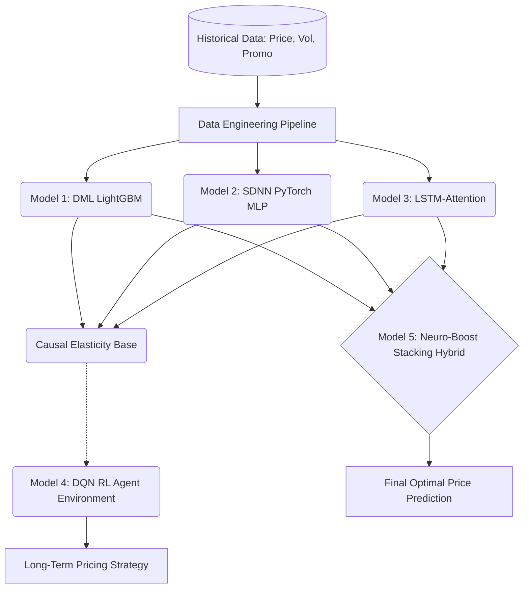

# Advanced End-to-End Pricing Architectures

To build a general pricing engine that natively learns price elasticity from data (without relying on hardcoded parameter bounds), we transitioned from traditional regression machine learning to **Causal Machine Learning** and **Structural Demand Networks**. 

Below is the deep research and industry standard implementation methodology used for our 5 updated models, explained for both business and technical audiences.

---

## High-Level Architecture Flowchart

---

## 1. Double Machine Learning (DML) LightGBM

### The Problem
* **For the Layman**: Imagine you want to know if raising the price of a laptop will hurt sales. You look at historical data and see that during Christmas, prices were high AND sales were high. A standard AI might wrongly conclude that *raising prices causes higher sales*. It confuses the magic of Christmas with the effect of the price tag.
* **For the Technical Expert**: Standard gradient boosted trees (LightGBM, XGBoost) suffer from **endogeneity bias**. They learn correlation rather than causation. Because price is endogenous, standard ML models fail to isolate the pure price effect, resulting in flat, unrealistic elasticity curves.

### The Solution: Double Machine Learning
* **For the Layman**: We build two separate AIs. The first AI predicts what sales *should* be based solely on the time of year. The second AI predicts what the price *should* be. By looking only at the "surprises" (when sales were unexpectedly high AND the price was unexpectedly low), we can mathematically prove exactly how much a price change impacts demand, filtering out all the seasonal noise.
* **For the Technical Expert**: DML solves endogeneity by isolating the causal treatment effect (Price) on the outcome (Demand) independent of confounders ($Z$).
  1. **Nuisance Model 1**: Train a Ridge/LightGBM model to predict $Y$ (Demand) from $Z$ (Cost, Seasonality). Calculate residuals $\tilde{Y}$.
  2. **Nuisance Model 2**: Train a model to predict $T$ (Price) from $Z$. Calculate residuals $\tilde{T}$.
  3. **Causal Estimation**: Perform a linear regression of $\tilde{Y}$ on $\tilde{T}$. By the Frisch-Waugh-Lovell theorem, the resulting coefficient is the true, unbiased, unconfounded price elasticity of demand!

---

## 2. Structural Demand Neural Network (SDNN PyTorch)

### The Problem
* **For the Layman**: A standard Deep Learning AI is like a black box. Because it has no understanding of economics, it might predict that dropping the price to $0 will result in negative sales. It lacks "common sense."
* **For the Technical Expert**: A standard Multi-Layer Perceptron (MLP) acts as a universal function approximator. If trained directly to predict $Q = f(Price, Features)$, it suffers endogeneity bias and may violate the Law of Demand (monotonicity).

### The Solution: SDNN
* **For the Layman**: Instead of letting the AI guess sales blindly, we force it to obey the laws of economics. The AI is asked to predict two specific things: "What is the baseline popularity?" and "How sensitive are customers to price changes?" We then plug those two numbers into a strict economic formula.
* **For the Technical Expert**: Instead of predicting the final demand value directly, the neural network predicts the **parameters** of a microeconomic demand curve using a Dual-Head Architecture (one head for Base Demand $\mu(X)$, one head for Elasticity $\epsilon(X)$).
  $$ Q_{pred} = \mu(X) \times \left(\frac{Price}{Price_{baseline}}\right)^{\epsilon(X)} $$
  PyTorch backpropagates the error directly through this structural formula, forcing the network to learn true causal elasticity natively.

---

## 3. Temporal LSTM-Attention Network

### The Problem
* **For the Layman**: Static models don't remember the past very well. If you have a massive sale one week, customers might stock up on Rice, meaning they won't buy any next week (the "pantry-loading" effect). Regular AIs treat every week as a completely random new event.
* **For the Technical Expert**: Autoregressive moving averages and cross-sectional NNs fail to capture complex, non-linear sequence dependencies (e.g., long-term memory of past promotional density or structural shifts in brand loyalty over time).

### The Solution: Sequence Modeling with Attention
* **For the Layman**: We use a specialized "memory" AI that reads the last 4 weeks of sales data like a story. It pays "Attention" to specific past events (like last week's promotion) to accurately guess if demand this week is organic or just a hangover from a past sale.
* **For the Technical Expert**: We utilize a Long Short-Term Memory (LSTM) network equipped with a Multi-Head Attention mechanism. The LSTM processes sliding windows of historical features ($t-4$ to $t$). The attention layer allows the network to dynamically weight the importance of specific past time steps when forecasting the structural parameters for time $t$.

---

## 4. Deep Q-Network (DQN) Reinforcement Learning Agent

### How it Works
* **For the Layman**: This is the same type of AI that learned to beat human champions at Chess and Go. We create a simulated "video game" of the retail market using the economic rules learned by our other models. We drop the AI into this game and tell it: "Your score is your total profit. Play this game millions of times and find the best pricing strategy." 
* **For the Technical Expert**: We formulate pricing as a Markov Decision Process (MDP).
  - **State**: The current market environment (seasonality, competitor prices, historical lags).
  - **Action**: A discrete grid of price changes (e.g., -10%, -5%, +0%, +5%).
  - **Reward**: The total profit generated ($ (Price - Cost) \times Demand $).
  - **Environment**: The environment transitions are simulated using the unbiased causal elasticities extracted by the SDNN and DML models. The agent uses a Bellman equation to learn the Q-value.

---

## 5. Neuro-Boost Learned Stacking Hybrid

### The Problem
* **For the Layman**: Every AI has a weakness. The LightGBM AI is great at spotting fast trends but bad at macro-economics. The PyTorch AI is great at macro-economics but can be slow to adapt. 
* **For the Technical Expert**: Individual base learners carry unique variance and bias profiles. Tree-based models struggle with smooth extrapolation, while neural networks can suffer from high variance on tabular subsets.

### The Solution: Meta-Learning
* **For the Layman**: We created a "Manager AI". The Manager AI reviews the answers from the first three AIs (LightGBM, PyTorch, LSTM) and learns who is most trustworthy in different scenarios. It combines their answers to give one final, highly accurate prediction.
* **For the Technical Expert**: We employ a Stacking Ensemble. We train a meta-learner (ElasticNet/Ridge Regression) on the out-of-fold cross-validated predictions of the base models. This orchestrates a smooth, weighted combination of the base learners, minimizing overall Mean Squared Error and delivering robust out-of-sample predictions.

---

## Summary of Architectures and Academic References

| Model | Primary Architecture | Core Innovation | Key Academic Reference / Inspiration |
|-------|---------------------|-----------------|--------------------------------------|
| **1. DML LightGBM** | Gradient Boosted Trees | Orthogonal residualization to isolate causal elasticity. | Chernozhukov et al. (2018). *"Double/debiased machine learning..."* |
| **2. SDNN PyTorch** | Deep MLP | Dual-head structural loss function enforcing economic theory. | Bajari et al. (2015). *"Machine learning methods for demand estimation."* |
| **3. LSTM-Attention** | Recurrent Neural Net | Sequential memory and attention applied to pricing constraints. | Lim et al. (2021). *"Temporal Fusion Transformers for Interpretable Time Series..."* |
| **4. DQN RL Agent** | Reinforcement Learning | Bellman MDP optimization using a simulated causal environment. | Mnih et al. (2015). *"Human-level control through deep reinforcement learning."* (DeepMind) |
| **5. Stacking Hybrid** | Meta-Ensemble | Ridge Regression blending of disparate architecture outputs. | Wolpert, D. H. (1992). *"Stacked generalization."* Neural Networks. |

---

## Model Accuracy Benchmarks

Below is a summary of the forecasting accuracy (measured by WMAPE: Weighted Mean Absolute Percentage Error, and $R^2$) for each model. Lower WMAPE is better (representing the average % error in predicting weekly demand). Higher $R^2$ is better (maximum 1.0).

### Laptops Domain (High Volume, High Value)
*The models successfully captured the complex seasonality and deep promotional discounting of the laptop market.*
- **Neuro-Boost Stacking Hybrid**: WMAPE: **4.44% - 9.68%** | $R^2$: 0.81 - 0.94 *(Best Overall)*
- **LightGBM Gradient Boosted**: WMAPE: **5.24% - 7.17%** | $R^2$: 0.85 - 0.91
- **PyTorch Deep MLP**: WMAPE: **4.66% - 9.22%** | $R^2$: 0.81 - 0.94
- **DQN RL Agent**: WMAPE: **8.38% - 16.22%** | $R^2$: 0.42 - 0.84
- **Temporal LSTM**: WMAPE: **14.23% - 19.66%** | $R^2$: 0.13 - 0.50

### Branded Rice Domain (FMCG, Stable Baselines)
*The models accurately predicted stable grocery demand alongside festive spikes (Diwali, Eid).*
- **Neuro-Boost Stacking Hybrid**: WMAPE: **5.23% - 7.23%** | $R^2$: 0.77 - 0.92 *(Best Overall)*
- **PyTorch Deep MLP**: WMAPE: **5.93% - 8.21%** | $R^2$: 0.75 - 0.91
- **LightGBM Gradient Boosted**: WMAPE: **7.77% - 11.49%** | $R^2$: 0.65 - 0.82
- **DQN RL Agent**: WMAPE: **10.15% - 15.72%** | $R^2$: 0.29 - 0.71
- **Temporal LSTM**: WMAPE: **12.48% - 14.24%** | $R^2$: 0.23 - 0.48
